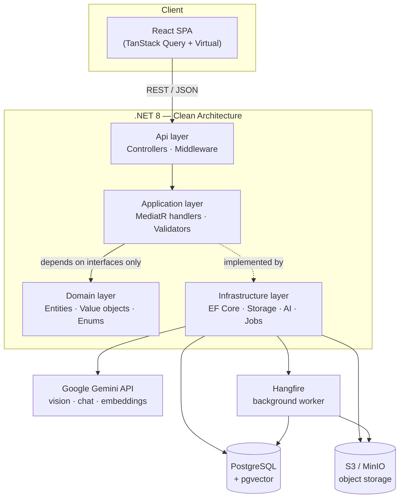
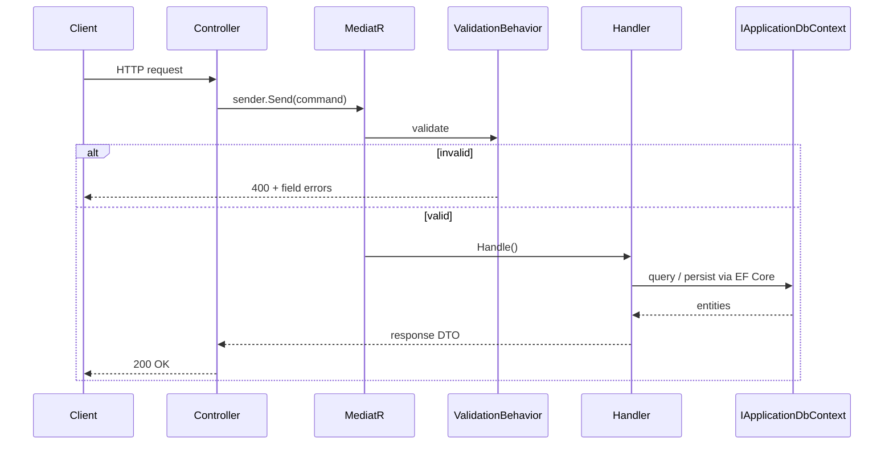
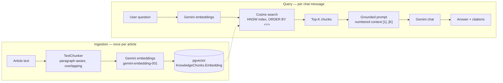

# Smart Analog Photo Hub & AI Darkroom Assistant

[](https://github.com/BuchtaMakova/AnalogApp/actions/workflows/ci.yml)
[](https://dotnet.microsoft.com/)
[](https://react.dev/)
[](https://github.com/pgvector/pgvector)

> A personal photo library for scanned analog film, a gear/film-roll manager, and an AI
> photography mentor — multimodal vision critique per photo, plus a RAG chat assistant grounded in
> an analog-technique knowledge base. Built as a Clean Architecture reference implementation:
> CQRS, async background processing, and a real (not toy) RAG pipeline over `pgvector`.

**Try it in one command, no API key required** — a built-in mock AI provider makes every feature,
including vision critique and RAG chat, explorable straight from a fresh clone:

```bash
git clone https://github.com/BuchtaMakova/AnalogApp.git && cd AnalogApp
docker compose up --build
```

Open `http://localhost:3000`.

---

## Table of contents

- [What it does](#what-it-does)
- [Tech stack](#tech-stack)
- [Architecture](#architecture)
- [Quick start](#quick-start)
- [Authentication & authorization](#authentication--authorization)
- [Testing](#testing)
- [Engineering challenges & solutions](#engineering-challenges--solutions)
- [Project structure](#project-structure)
- [API overview](#api-overview)

## What it does

| Module | Capabilities |
|---|---|
| **Photo Library** | Virtualized grid (thousands of photos, smooth scroll), BlurHash placeholders, drag-and-drop upload with per-file progress, filter by roll/camera/lens/tag/rating, collapsible per-roll sections |
| **Photo Detail (Lightbox)** | Keyboard/click prev-next navigation that seamlessly paginates past the currently loaded page, non-destructive 90° rotation for sideways scans, one-click download with a friendly filename |
| **Bulk actions** | Multi-select photos for delete or download — "download separately" (one presigned link per photo) or "download as ZIP" (bundled server-side) |
| **AI Vision Critique** | Sends each photo to a multimodal LLM (Gemini) with a strict JSON schema; returns composition, lighting, posing (portraits only) and concrete recommendations, then auto-tags the photo |
| **Knowledge Base & RAG Chat** | Ingests technique articles (chunked + embedded), answers free-text questions with pgvector cosine search and numbered source citations |
| **Gear Vault** | Camera bodies, lenses, flashes — full CRUD, linked to film rolls and individual frames |
| **Roll Manager** | Film roll lifecycle: loaded → shot → sent to lab → developed → scanned → archived |
| **Albums & Organization** | Star ratings, manual + AI-suggested tags, album curation |

## Tech stack

| Layer | Technology | Why |
|---|---|---|
| Backend | .NET 8, Clean Architecture (Domain / Application / Infrastructure / Api) | Testable business logic with zero framework leakage into the domain |
| API pattern | MediatR (CQRS) + FluentValidation pipeline behavior | Every use case is a single, independently testable handler |
| Database | PostgreSQL 16 + `pgvector` | Relational data and vector embeddings in one datastore — no separate vector DB to operate |
| ORM | Entity Framework Core 8 | Code-first migrations, LINQ-to-SQL including vector cosine search |
| Object storage | S3-compatible (MinIO locally, Cloudflare R2 / AWS S3 in production) | Presigned upload/download, provider-agnostic via a thin port |
| Background jobs | Hangfire | Thumbnail/preview generation and BlurHash computation off the request path |
| AI | Google Gemini (`gemini-3.6-flash` vision + chat, `gemini-embedding-001` embeddings) | Free tier, strict JSON schema output, single provider for vision + chat + embeddings |
| Frontend | React 19, TypeScript, Tailwind CSS 4, Vite | Fast dev loop, type-safe end to end |
| Data fetching | TanStack Query | Cache, background refetch, infinite scroll |
| Virtualization | TanStack Virtual | Renders only visible grid rows regardless of library size |
| Testing | xUnit, FluentAssertions, Moq, EF Core InMemory | Fast, database-free handler tests |
| CI | GitHub Actions | Build + test on every push/PR, backend and frontend in parallel |
| Auth | JWT bearer (ASP.NET Core `AddJwtBearer`) + ASP.NET Core Identity's PBKDF2 hasher | Stateless auth with zero extra infrastructure; ownership (`UserId` on every row), not role claims, is the real authorization boundary |
| Monitoring | Serilog (structured/JSON logs) + OpenTelemetry → Prometheus `/metrics`, `/health` | Correlation IDs per request, scrapeable metrics, no external collector required for this project's scope |

## Architecture

### System overview



The Application layer never references Infrastructure directly — it depends on ports
(`IApplicationDbContext`, `IFileStorageService`, `IVisionAnalysisService`, `IEmbeddingService`,
`IChatCompletionService`) that Infrastructure implements. That seam is what makes both the
[mock AI provider](#engineering-challenges--solutions) and the test suite possible without
touching a single line of business logic.

### CQRS request flow



Every command and query is one handler, one validator, one DTO — no service-layer god classes, no
business logic in controllers.

### Async photo processing

Uploads never block on image processing — the client streams straight to object storage, and a
background worker does the expensive work:

```mermaid
sequenceDiagram
    participant C as Browser
    participant API
    participant S3 as S3 / MinIO
    participant HF as Hangfire job
    participant DB as Postgres

    C->>API: POST /photos/upload-url
    API-->>C: presigned PUT URL
    C->>S3: PUT original file (direct upload)
    C->>API: POST /photos (register)
    API->>DB: INSERT Photo (status = Uploaded)
    API-->>HF: enqueue PhotoProcessingJob
    API-->>C: 201 Created (instant)

    Note over HF: runs asynchronously, off the request path
    HF->>S3: download original
    HF->>HF: generate WebP thumbnail + preview<br/>compute BlurHash
    HF->>S3: upload derivatives
    HF->>DB: UPDATE Photo (status = Ready, BlurHash, dimensions)

    C->>API: GET /photos (TanStack Query)
    Note over C: BlurHash renders instantly;<br/>thumbnail fades in once loaded
```

### RAG pipeline



## Quick start

### One command, zero config

```bash
docker compose up --build
```

Brings up Postgres (with `pgvector`), MinIO, the API, and the frontend behind nginx. AI features
run in **mock mode by default** — no Gemini API key needed to try vision critique or RAG chat; see
[Demo mode](#demo-mode-no-api-key-required) below.

- Frontend: `http://localhost:3000`
- API: `http://localhost:8080` (health check at `/health`, Hangfire dashboard at `/hangfire`)

### With real Gemini AI

Get a free key from [Google AI Studio](https://aistudio.google.com/apikey):

```bash
export USE_MOCK_AI=false
export GEMINI_API_KEY=AIza...
docker compose up --build
```

### Native dev (faster iteration)

Run just the infra in Docker, API and frontend natively:

```bash
docker compose up postgres minio minio-init -d

cd backend
dotnet user-secrets init --project src/AnalogHub.Api
dotnet user-secrets set "Jwt:Secret" "$(openssl rand -base64 48)" --project src/AnalogHub.Api  # required — signs auth tokens
dotnet user-secrets set "Gemini:ApiKey" "AIza..." --project src/AnalogHub.Api   # optional, omit for mock mode
dotnet run --project src/AnalogHub.Api

cd frontend
npm install && npm run dev
```

Frontend at `http://localhost:5173`, API at `http://localhost:5156`.

### Demo mode (no API key required)

Set `UseMockAi: true` (the Docker Compose default) and the DI container swaps in
[`MockVisionAnalysisService`](backend/src/AnalogHub.Infrastructure/AI/Mock/MockVisionAnalysisService.cs),
[`MockEmbeddingService`](backend/src/AnalogHub.Infrastructure/AI/Mock/MockEmbeddingService.cs) and
[`MockChatCompletionService`](backend/src/AnalogHub.Infrastructure/AI/Mock/MockChatCompletionService.cs)
for the real Gemini-backed ones — same interfaces, zero network calls. Vision critique returns one
of a few hand-written, realistic reviews; embeddings use a deterministic feature-hashing vectorizer
so RAG retrieval still demonstrably finds keyword-relevant articles; chat answers quote the actual
retrieved context so the response visibly reflects real retrieval, not a static string. See
[Engineering challenges & solutions](#engineering-challenges--solutions) for how that's built.

### Connecting real object storage

The local MinIO container is fine for exploring the app, but photos vanish if its volume is wiped
and it's only reachable on your machine. To point the app at a real bucket instead (Cloudflare R2,
AWS S3, or any S3-compatible provider) — shared storage that works the same way whether it's you or
several people using the app:

1. **Create a bucket** and an S3-compatible access key for it (Cloudflare dashboard → R2 → Create
   bucket, then Manage API tokens → create an S3 API token scoped to that bucket; for AWS, an S3
   bucket + an IAM user/key with `s3:GetObject`/`PutObject`/`DeleteObject` on it).
2. **Configure CORS on the bucket** — without this, every upload and every thumbnail/preview image
   fails in the browser with a CORS error, since the bucket's origin differs from the app's. Apply
   this policy (via the R2/S3 dashboard's CORS settings, or `aws s3api put-bucket-cors` /
   `wrangler r2 bucket cors`), replacing the origin with wherever the frontend is actually served
   from — add more entries to `AllowedOrigins` for additional domains (e.g. once you deploy
   somewhere other than `localhost`):
   ```json
   [
     {
       "AllowedOrigins": ["http://localhost:3000"],
       "AllowedMethods": ["GET", "PUT", "HEAD"],
       "AllowedHeaders": ["*"],
       "ExposeHeaders": ["ETag"],
       "MaxAgeSeconds": 3600
     }
   ]
   ```
3. **Set these as environment variables** in your own shell before `docker compose up --build`
   (never commit real credentials — this mirrors how `GEMINI_API_KEY` and `JWT_SECRET` work):
   ```powershell
   $env:STORAGE_SERVICE_URL = "https://<account-id>.r2.cloudflarestorage.com"  # R2; omit for AWS S3
   $env:STORAGE_BUCKET_NAME = "your-bucket-name"
   $env:STORAGE_ACCESS_KEY = "..."
   $env:STORAGE_SECRET_KEY = "..."
   $env:STORAGE_USE_SIGV4 = "true"          # required — R2 and AWS S3 only accept SigV4
   $env:STORAGE_PUBLIC_SERVICE_URL = ""     # empty — the bucket endpoint is already public
   docker compose up --build -d
   ```
   `Storage__UseSignatureVersion4` matters: MinIO accepts the older SigV2 the app defaults to, but
   R2 and real AWS S3 reject it outright. Leaving `STORAGE_PUBLIC_SERVICE_URL` unset would instead
   default to the local MinIO override (`http://localhost:9000`) and break every presigned URL — see
   `S3StorageOptions.UseSignatureVersion4` and `.PublicServiceUrl` for why each one exists.
4. The local `minio`/`minio-init` containers still start (harmless if unused) — they're not worth
   conditionally disabling for a single config swap.

## Authentication & authorization

Every API endpoint requires a valid JWT bearer token by default — enforced via an ASP.NET Core
`FallbackPolicy` (`RequireAuthenticatedUser()`), rather than annotating each controller
individually. `/api/auth/*`, `/health`, and `/metrics` are the explicit exceptions (`[AllowAnonymous]`
/ `.AllowAnonymous()`), since the last two are hit by orchestration tooling (Docker healthchecks,
Prometheus scrapers) that never has a token.

```bash
curl -X POST http://localhost:8080/api/auth/register \
  -H "Content-Type: application/json" \
  -d '{"email":"you@example.com","password":"at-least-8-chars"}'
# → { "token": "eyJ...", "expiresAtUtc": "...", "userId": "...", "email": "...", "role": "Admin" }
```

- **Passwords** are hashed with ASP.NET Core Identity's `PasswordHasher<T>` (PBKDF2) — pulled in as
  a standalone package, not the full Identity stores/UI, since this app has one custom `User`
  entity and needs only the hashing algorithm.
- **Bootstrap admin.** The very first account to register becomes `Admin`; every account after that
  defaults to `User`. The demo gear/film-roll seed data is assigned to that first account too (see
  below), so whoever sets the app up first gets a populated library to explore immediately.
- **Every user has their own private library — never a shared one.** Photos, film rolls, gear, and
  albums all carry a `UserId`; every query and command is scoped to the caller's own id via
  `ICurrentUserService` (reads the JWT's subject claim). Reaching for someone else's photo — by ID,
  by putting it in your album, by linking a film roll to their camera body — returns a plain 404,
  the same as if it didn't exist, rather than a 403 that would confirm it does. Tags and the
  Knowledge Base stay shared/global across all users, since they're vocabulary and reference
  material, not personal content.
- **Frontend** stores the JWT in `localStorage`, attaches it via an axios request interceptor, and a
  response interceptor clears it and redirects to `/login` on any `401` (except from the login/register
  calls themselves, where a `401` just means "wrong password").
- **Local dev secret.** The HMAC signing key lives in `dotnet user-secrets` (`Jwt:Secret`), never in
  a committed `appsettings.*.json`; `docker compose up` uses a documented demo default
  (`JWT_SECRET` env var to override) the same way it does for the Postgres/MinIO demo passwords.

## Testing

```bash
cd backend && dotnet test AnalogHub.sln
cd frontend && npm run test:run
```

**Backend — 99 tests** (xUnit + FluentAssertions + Moq) covering every CQRS handler in the
Gear Vault, Roll Manager, Album, Photo, and Auth modules, plus the RAG assistant's grounding/citation
logic and the `TextChunker`. Handlers run against an EF Core InMemory database with mocked service
ports (`IVisionAnalysisService`, `IFileStorageService`, `IPasswordHasher`, `IJwtTokenGenerator`,
`ISender`) — no real database or network calls. `SearchKnowledgeChunksQueryHandler`'s actual pgvector
cosine query is deliberately *not* unit tested — only Postgres can translate `CosineDistance`, so
that's an integration-test concern; `AskKnowledgeBaseCommandHandler` covers its own logic (prompt
grounding, citation mapping) against a mocked retrieval result instead. A dedicated suite
(`ValidationPipelineTests`) exercises the real DI-wired MediatR pipeline rather than calling handlers
directly, specifically to catch pipeline-registration regressions like the one described below —
handler-level tests alone would never have caught it, since they bypass the pipeline entirely.

**Frontend — Vitest + React Testing Library**, covering the pure formatting/storage utilities
(`lib/format.ts`, `lib/authStorage.ts`) and interactive UI primitives (`StarRating`, `Badge`,
`PhotoCard`) — component behavior (click-to-rate, disabled state, tone classes, token persistence,
click-to-select vs. open-lightbox), not snapshot tests.

GitHub Actions runs `dotnet build` + `dotnet test` and `tsc -b` + `vitest run` + `npm run build` for
the frontend, on every push and PR — see [`.github/workflows/ci.yml`](.github/workflows/ci.yml).

## Engineering challenges & solutions

**Instant-feeling image loading with BlurHash.** A grid of thousands of scanned frames can't wait
on network round-trips before showing *something*. Each photo stores a ~20–30 character
[BlurHash](https://blurha.sh/) string alongside its thumbnail — decoded client-side into a blurred
gradient canvas that closely approximates the real image, rendered before the actual WebP thumbnail
has even started downloading. Compared to a generic gray placeholder, it eliminates layout shift and
makes the grid feel populated instantly; compared to shipping a real low-res thumbnail, it's ~30
bytes instead of several KB.

**Vector search that doesn't need a second database.** RAG retrieval uses `pgvector`'s HNSW index
(`CREATE INDEX ... USING hnsw (embedding vector_cosine_ops)`) rather than IVFFlat — HNSW gives
better recall at query time without needing to pre-train on a representative data sample first,
which matters when the knowledge base grows incrementally one article at a time. The real win,
though, is architectural: relational metadata (film rolls, gear, tags) and vector embeddings live in
the *same* Postgres instance and the *same* transaction boundary, instead of syncing two databases.

**Adapting to a fast-moving Gemini API.** The AI layer was originally built against OpenAI, then
migrated to Gemini — and even after that migration landed, live testing surfaced real
incompatibilities within a single working session:
- `text-embedding-004` had already been replaced by `gemini-embedding-001`, whose *native* output is
  3072 dimensions, not the 768 the schema was built for. Fixed by requesting
  `outputDimensionality: 768` — Gemini's embeddings support Matryoshka-style truncation, so this
  stays a real, quality embedding rather than a naive vector slice.
- The originally-configured chat/vision model (`gemini-1.5-flash`, then `gemini-2.5-flash`) returned
  `404 ... no longer available to new users` *while testing* — Google rotates model availability
  aggressively. The fix that matters more than the specific model name: a code comment and README
  section pointing at `GET /v1beta/models` so the next rotation is a five-minute fix, not a
  debugging session.
- Presigned S3 upload URLs were silently signed as `https://` even when MinIO was configured for
  plain `http://` — traced to the AWS SDK's presigning path ignoring `UseHttp` for SigV2 signatures.
  Fixed by rewriting the scheme post-signing, which is safe here specifically because SigV2's
  string-to-sign doesn't cover scheme or host.
- All enum DTOs were serializing as raw integers instead of names (`"format": 35` instead of
  `"format": "ThirtyFiveMm"`) because `AddControllers()` doesn't add `JsonStringEnumConverter` by
  default — invisible until a real frontend rendered a literal `35` where `35mm` was expected.

**A validation pipeline that silently validated nothing — for every void command.** `ValidationBehavior<TRequest, TResponse>`
was constrained to `where TRequest : IRequest<TResponse>`, which looks like the obviously-correct
constraint for a MediatR pipeline behavior. It compiled, it worked for every command with a return
value (`CreateAlbumCommand : IRequest<AlbumDto>`, `RegisterCommand : IRequest<AuthResultDto>`), and
FluentValidation errors came back as clean `400`s in exactly those cases — so nothing looked wrong.
But plain void commands (`UpdatePhotoRatingCommand : IRequest`, no generic) don't implement
`IRequest<Unit>` in MediatR 12 the way they did in older versions, so the DI container could never
close that generic for `TResponse = Unit`, silently produced zero pipeline behaviors, and invalid
input (a rating of 9, a rotation of 45°) sailed straight past validation into the database's check
constraint as a raw `500` instead of a `400`. Found by comparing a working `IRequest<T>` case against
a broken void one side by side, confirmed with a one-line diagnostic
(`serviceProvider.GetServices<IPipelineBehavior<...>>().Count()` returning `0`), fixed by relaxing the
constraint to `where TRequest : notnull` — matching what MediatR's own `IPipelineBehavior<,>`
actually requires, nothing more. Locked in by `ValidationPipelineTests`, which sends a real command
through the real DI container rather than calling a handler directly, since that's the only way this
class of bug shows up at all.

**A demo mode that's actually useful, not just a stub.** `UseMockAi: true` doesn't return an empty
placeholder — `MockEmbeddingService` uses the
[hashing trick](https://en.wikipedia.org/wiki/Feature_hashing) (each word hashes into one of 768
dimensions with a signed weight, then the vector is L2-normalized) to produce deterministic,
keyword-sensitive vectors. It's not a real embedding model, but cosine similarity between two texts
tracks vocabulary overlap closely enough that RAG retrieval genuinely finds the right article for a
demo question — provably, not just plausibly: a query about flash exposure retrieves chunks from
the flash-technique article, not the film-format one.

## Project structure

```
backend/
  src/
    AnalogHub.Domain/          entities, enums, value objects — zero framework dependencies
    AnalogHub.Application/     CQRS (MediatR), DTOs, validators, service interfaces (ports)
    AnalogHub.Infrastructure/  EF Core + pgvector, S3 storage, Hangfire jobs, Gemini + mock AI
    AnalogHub.Api/             controllers, DI composition root, middleware
  tests/
    AnalogHub.Tests/           xUnit + FluentAssertions + Moq, EF Core InMemory
  Dockerfile
frontend/
  src/
    api/            typed HTTP client per resource
    features/       photo-library, gear-vault, roll-manager, knowledge-base
    components/ui/  shared primitives (Button, Dialog, Tabs, StarRating, ...)
  Dockerfile
  nginx.conf
.github/workflows/ci.yml
docker-compose.yml
```

## API overview

Every endpoint below is scoped to the caller's own data — "Authenticated" means any signed-in user
can call it, but only ever against photos/gear/rolls/albums they themselves own (see
[Authentication & authorization](#authentication--authorization)).

| Endpoint | Purpose | Access |
|---|---|---|
| `POST /api/auth/register`, `POST /api/auth/login` | Create an account / exchange credentials for a JWT | Anonymous |
| `POST /api/photos/upload-url` → `POST /api/photos` | Two-step upload: presigned URL, then register (enqueues background processing) | Authenticated |
| `GET /api/photos` | Paginated, filterable listing (film roll, camera, lens, tag, rating) | Authenticated |
| `POST /api/photos/{id}/analyze` | Runs AI vision critique, persists it, applies suggested tags | Authenticated |
| `PUT /api/photos/{id}/rating`, `POST/DELETE /api/photos/{id}/tags` | Organize: rating, manual tags | Authenticated |
| `PUT /api/photos/{id}/rotation` | Non-destructive 90°/180°/270° rotation for scans that came in sideways | Authenticated |
| `POST /api/photos/download-urls` | Presigned, force-download links (with a friendly filename) for a batch of photos | Authenticated |
| `POST /api/photos/download-zip` | Bundles a batch of photos' originals into a single ZIP | Authenticated |
| `DELETE /api/photos/{id}` | Delete a photo (and its original/preview/thumbnail in storage); supports multi-select in the UI | Authenticated |
| `GET/POST/PUT/DELETE /api/gear/{camera-bodies,lenses,flashes}` | Gear Vault CRUD | Authenticated |
| `GET/POST/PUT/DELETE /api/film-rolls` | Roll lifecycle management | Authenticated |
| `GET/POST/PUT/DELETE /api/albums`, `POST/DELETE /api/albums/{id}/photos/{photoId}` | Album curation | Authenticated |
| `POST /api/knowledge-base/documents` | Ingest an article (chunk + embed) | Authenticated |
| `GET /api/knowledge-base/search` | Raw cosine-similarity search, no LLM | Authenticated |
| `POST /api/knowledge-base/ask` | RAG chat: retrieval + grounded answer + citations | Authenticated |
| `GET /health`, `GET /metrics` | Liveness probe, Prometheus scrape target | Anonymous |

Full request/response contracts are in Swagger at `/swagger` (Development environment) — click
**Authorize** and paste a JWT from `/api/auth/login` to try protected endpoints interactively.
