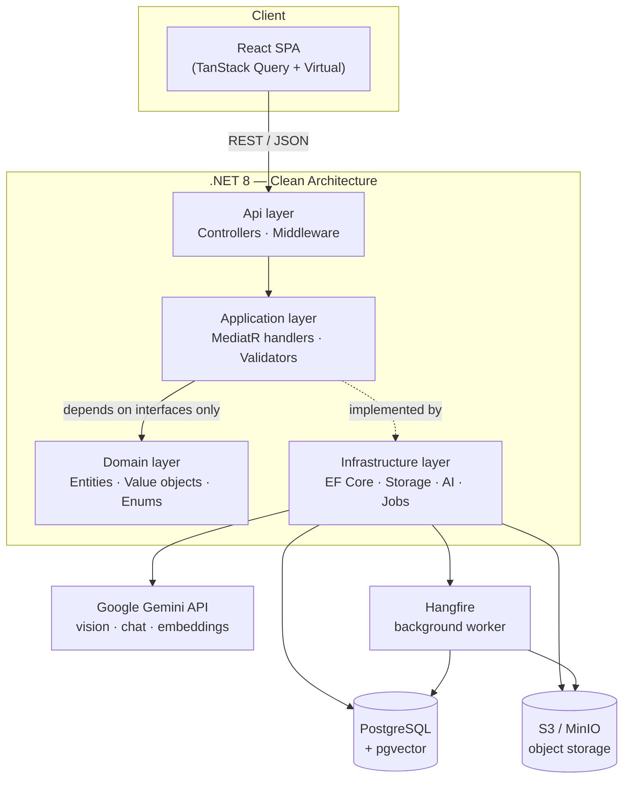
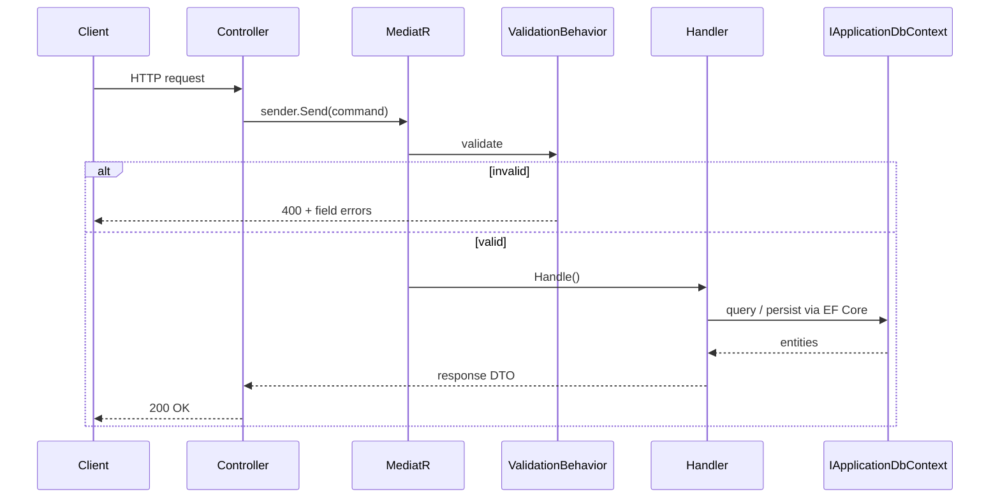
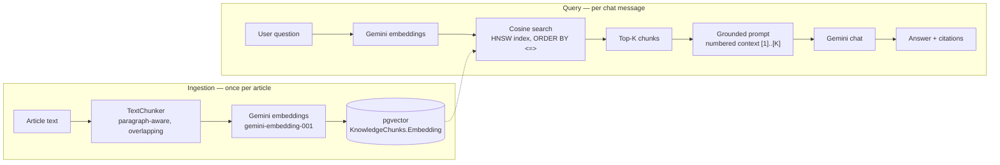

# Smart Analog Photo Hub & AI Darkroom Assistant

[](https://github.com/yourusername/analog-photo-hub/actions/workflows/ci.yml)
[](https://dotnet.microsoft.com/)
[](https://react.dev/)
[](https://github.com/pgvector/pgvector)

> A personal photo library for scanned analog film, a gear/film-roll manager, and an AI
> photography mentor — multimodal vision critique per photo, plus a RAG chat assistant grounded in
> an analog-technique knowledge base. Built as a Clean Architecture reference implementation:
> CQRS, async background processing, and a real (not toy) RAG pipeline over `pgvector`.

**Try it in one command, no API key required** — a built-in mock AI provider makes every feature,
including vision critique and RAG chat, explorable straight from a fresh clone:

```bash
git clone https://github.com/yourusername/analog-photo-hub.git && cd analog-photo-hub
docker compose up --build
```

Open `http://localhost:3000`.

---

## Table of contents

- [What it does](#what-it-does)
- [Tech stack](#tech-stack)
- [Architecture](#architecture)
- [Quick start](#quick-start)
- [Testing](#testing)
- [Engineering challenges & solutions](#engineering-challenges--solutions)
- [Project structure](#project-structure)
- [API overview](#api-overview)

## What it does

| Module | Capabilities |
|---|---|
| **Photo Library** | Virtualized grid (thousands of photos, smooth scroll), BlurHash placeholders, drag-and-drop upload with per-file progress, filter by roll/camera/lens/tag/rating |
| **AI Vision Critique** | Sends each photo to a multimodal LLM (Gemini) with a strict JSON schema; returns composition, lighting, posing (portraits only) and concrete recommendations, then auto-tags the photo |
| **Knowledge Base & RAG Chat** | Ingests technique articles (chunked + embedded), answers free-text questions with pgvector cosine search and numbered source citations |
| **Gear Vault** | Camera bodies, lenses, flashes — full CRUD, linked to film rolls and individual frames |
| **Roll Manager** | Film roll lifecycle: loaded → shot → sent to lab → developed → scanned → archived |
| **Albums & Organization** | Star ratings, manual + AI-suggested tags, album curation |

## Tech stack

| Layer | Technology | Why |
|---|---|---|
| Backend | .NET 8, Clean Architecture (Domain / Application / Infrastructure / Api) | Testable business logic with zero framework leakage into the domain |
| API pattern | MediatR (CQRS) + FluentValidation pipeline behavior | Every use case is a single, independently testable handler |
| Database | PostgreSQL 16 + `pgvector` | Relational data and vector embeddings in one datastore — no separate vector DB to operate |
| ORM | Entity Framework Core 8 | Code-first migrations, LINQ-to-SQL including vector cosine search |
| Object storage | S3-compatible (MinIO locally, Cloudflare R2 / AWS S3 in production) | Presigned upload/download, provider-agnostic via a thin port |
| Background jobs | Hangfire | Thumbnail/preview generation and BlurHash computation off the request path |
| AI | Google Gemini (`gemini-3.6-flash` vision + chat, `gemini-embedding-001` embeddings) | Free tier, strict JSON schema output, single provider for vision + chat + embeddings |
| Frontend | React 19, TypeScript, Tailwind CSS 4, Vite | Fast dev loop, type-safe end to end |
| Data fetching | TanStack Query | Cache, background refetch, infinite scroll |
| Virtualization | TanStack Virtual | Renders only visible grid rows regardless of library size |
| Testing | xUnit, FluentAssertions, Moq, EF Core InMemory | Fast, database-free handler tests |
| CI | GitHub Actions | Build + test on every push/PR, backend and frontend in parallel |

## Architecture

### System overview



The Application layer never references Infrastructure directly — it depends on ports
(`IApplicationDbContext`, `IFileStorageService`, `IVisionAnalysisService`, `IEmbeddingService`,
`IChatCompletionService`) that Infrastructure implements. That seam is what makes both the
[mock AI provider](#engineering-challenges--solutions) and the test suite possible without
touching a single line of business logic.

### CQRS request flow



Every command and query is one handler, one validator, one DTO — no service-layer god classes, no
business logic in controllers.

### Async photo processing

Uploads never block on image processing — the client streams straight to object storage, and a
background worker does the expensive work:

```mermaid
sequenceDiagram
    participant C as Browser
    participant API
    participant S3 as S3 / MinIO
    participant HF as Hangfire job
    participant DB as Postgres

    C->>API: POST /photos/upload-url
    API-->>C: presigned PUT URL
    C->>S3: PUT original file (direct upload)
    C->>API: POST /photos (register)
    API->>DB: INSERT Photo (status = Uploaded)
    API-->>HF: enqueue PhotoProcessingJob
    API-->>C: 201 Created (instant)

    Note over HF: runs asynchronously, off the request path
    HF->>S3: download original
    HF->>HF: generate WebP thumbnail + preview<br/>compute BlurHash
    HF->>S3: upload derivatives
    HF->>DB: UPDATE Photo (status = Ready, BlurHash, dimensions)

    C->>API: GET /photos (TanStack Query)
    Note over C: BlurHash renders instantly;<br/>thumbnail fades in once loaded
```

### RAG pipeline



## Quick start

### One command, zero config

```bash
docker compose up --build
```

Brings up Postgres (with `pgvector`), MinIO, the API, and the frontend behind nginx. AI features
run in **mock mode by default** — no Gemini API key needed to try vision critique or RAG chat; see
[Demo mode](#demo-mode-no-api-key-required) below.

- Frontend: `http://localhost:3000`
- API: `http://localhost:8080` (health check at `/health`, Hangfire dashboard at `/hangfire`)

### With real Gemini AI

Get a free key from [Google AI Studio](https://aistudio.google.com/apikey):

```bash
export USE_MOCK_AI=false
export GEMINI_API_KEY=AIza...
docker compose up --build
```

### Native dev (faster iteration)

Run just the infra in Docker, API and frontend natively:

```bash
docker compose up postgres minio minio-init -d

cd backend
dotnet user-secrets init --project src/AnalogHub.Api
dotnet user-secrets set "Gemini:ApiKey" "AIza..." --project src/AnalogHub.Api   # optional, omit for mock mode
dotnet run --project src/AnalogHub.Api

cd frontend
npm install && npm run dev
```

Frontend at `http://localhost:5173`, API at `http://localhost:5156`.

### Demo mode (no API key required)

Set `UseMockAi: true` (the Docker Compose default) and the DI container swaps in
[`MockVisionAnalysisService`](backend/src/AnalogHub.Infrastructure/AI/Mock/MockVisionAnalysisService.cs),
[`MockEmbeddingService`](backend/src/AnalogHub.Infrastructure/AI/Mock/MockEmbeddingService.cs) and
[`MockChatCompletionService`](backend/src/AnalogHub.Infrastructure/AI/Mock/MockChatCompletionService.cs)
for the real Gemini-backed ones — same interfaces, zero network calls. Vision critique returns one
of a few hand-written, realistic reviews; embeddings use a deterministic feature-hashing vectorizer
so RAG retrieval still demonstrably finds keyword-relevant articles; chat answers quote the actual
retrieved context so the response visibly reflects real retrieval, not a static string. See
[Engineering challenges & solutions](#engineering-challenges--solutions) for how that's built.

## Testing

```bash
cd backend
dotnet test AnalogHub.sln
```

23 tests covering `RegisterPhotoCommandHandler`, `AnalyzePhotoCommandHandler`,
`AskKnowledgeBaseCommandHandler`, and `TextChunker` — run against an EF Core InMemory database with
mocked service ports (`IVisionAnalysisService`, `IFileStorageService`, `ISender`), no real database
or network calls. `SearchKnowledgeChunksQueryHandler`'s actual pgvector cosine query is deliberately
*not* unit tested — only Postgres can translate `CosineDistance`, so that's an integration-test
concern; `AskKnowledgeBaseCommandHandler` covers its own logic (prompt grounding, citation mapping)
against a mocked retrieval result instead.

GitHub Actions runs the same `dotnet build` + `dotnet test`, plus `tsc -b` + `npm run build` for the
frontend, on every push and PR — see [`.github/workflows/ci.yml`](.github/workflows/ci.yml).

## Engineering challenges & solutions

**Instant-feeling image loading with BlurHash.** A grid of thousands of scanned frames can't wait
on network round-trips before showing *something*. Each photo stores a ~20–30 character
[BlurHash](https://blurha.sh/) string alongside its thumbnail — decoded client-side into a blurred
gradient canvas that closely approximates the real image, rendered before the actual WebP thumbnail
has even started downloading. Compared to a generic gray placeholder, it eliminates layout shift and
makes the grid feel populated instantly; compared to shipping a real low-res thumbnail, it's ~30
bytes instead of several KB.

**Vector search that doesn't need a second database.** RAG retrieval uses `pgvector`'s HNSW index
(`CREATE INDEX ... USING hnsw (embedding vector_cosine_ops)`) rather than IVFFlat — HNSW gives
better recall at query time without needing to pre-train on a representative data sample first,
which matters when the knowledge base grows incrementally one article at a time. The real win,
though, is architectural: relational metadata (film rolls, gear, tags) and vector embeddings live in
the *same* Postgres instance and the *same* transaction boundary, instead of syncing two databases.

**Adapting to a fast-moving Gemini API.** The AI layer was originally built against OpenAI, then
migrated to Gemini — and even after that migration landed, live testing surfaced real
incompatibilities within a single working session:
- `text-embedding-004` had already been replaced by `gemini-embedding-001`, whose *native* output is
  3072 dimensions, not the 768 the schema was built for. Fixed by requesting
  `outputDimensionality: 768` — Gemini's embeddings support Matryoshka-style truncation, so this
  stays a real, quality embedding rather than a naive vector slice.
- The originally-configured chat/vision model (`gemini-1.5-flash`, then `gemini-2.5-flash`) returned
  `404 ... no longer available to new users` *while testing* — Google rotates model availability
  aggressively. The fix that matters more than the specific model name: a code comment and README
  section pointing at `GET /v1beta/models` so the next rotation is a five-minute fix, not a
  debugging session.
- Presigned S3 upload URLs were silently signed as `https://` even when MinIO was configured for
  plain `http://` — traced to the AWS SDK's presigning path ignoring `UseHttp` for SigV2 signatures.
  Fixed by rewriting the scheme post-signing, which is safe here specifically because SigV2's
  string-to-sign doesn't cover scheme or host.
- All enum DTOs were serializing as raw integers instead of names (`"format": 35` instead of
  `"format": "ThirtyFiveMm"`) because `AddControllers()` doesn't add `JsonStringEnumConverter` by
  default — invisible until a real frontend rendered a literal `35` where `35mm` was expected.

**A demo mode that's actually useful, not just a stub.** `UseMockAi: true` doesn't return an empty
placeholder — `MockEmbeddingService` uses the
[hashing trick](https://en.wikipedia.org/wiki/Feature_hashing) (each word hashes into one of 768
dimensions with a signed weight, then the vector is L2-normalized) to produce deterministic,
keyword-sensitive vectors. It's not a real embedding model, but cosine similarity between two texts
tracks vocabulary overlap closely enough that RAG retrieval genuinely finds the right article for a
demo question — provably, not just plausibly: a query about flash exposure retrieves chunks from
the flash-technique article, not the film-format one.

## Project structure

```
backend/
  src/
    AnalogHub.Domain/          entities, enums, value objects — zero framework dependencies
    AnalogHub.Application/     CQRS (MediatR), DTOs, validators, service interfaces (ports)
    AnalogHub.Infrastructure/  EF Core + pgvector, S3 storage, Hangfire jobs, Gemini + mock AI
    AnalogHub.Api/             controllers, DI composition root, middleware
  tests/
    AnalogHub.Tests/           xUnit + FluentAssertions + Moq, EF Core InMemory
  Dockerfile
frontend/
  src/
    api/            typed HTTP client per resource
    features/       photo-library, gear-vault, roll-manager, knowledge-base
    components/ui/  shared primitives (Button, Dialog, Tabs, StarRating, ...)
  Dockerfile
  nginx.conf
.github/workflows/ci.yml
docker-compose.yml
```

## API overview

| Endpoint | Purpose |
|---|---|
| `POST /api/photos/upload-url` → `POST /api/photos` | Two-step upload: presigned URL, then register (enqueues background processing) |
| `GET /api/photos` | Paginated, filterable listing (film roll, camera, lens, tag, rating) |
| `POST /api/photos/{id}/analyze` | Runs AI vision critique, persists it, applies suggested tags |
| `PUT /api/photos/{id}/rating`, `POST/DELETE /api/photos/{id}/tags` | Organize: rating, manual tags |
| `GET/POST/PUT/DELETE /api/gear/{camera-bodies,lenses,flashes}` | Gear Vault CRUD |
| `GET/POST/PUT/DELETE /api/film-rolls` | Roll lifecycle management |
| `GET/POST/PUT/DELETE /api/albums`, `POST/DELETE /api/albums/{id}/photos/{photoId}` | Album curation |
| `POST /api/knowledge-base/documents` | Ingest an article (chunk + embed) |
| `GET /api/knowledge-base/search` | Raw cosine-similarity search, no LLM |
| `POST /api/knowledge-base/ask` | RAG chat: retrieval + grounded answer + citations |

Full request/response contracts are in Swagger at `/swagger` (Development environment).
